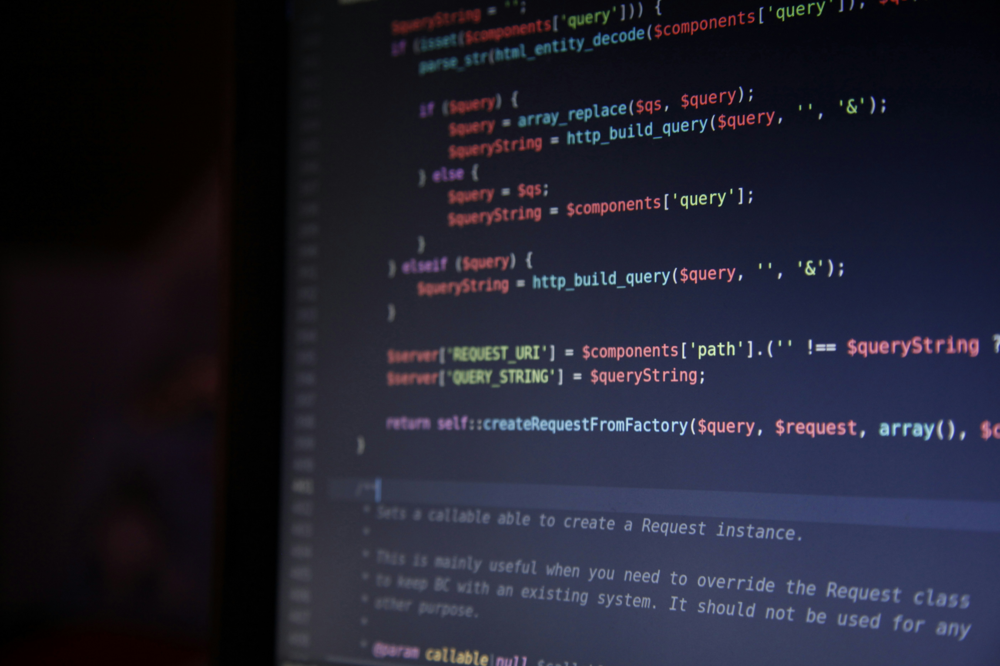

# 1DV608 "MVC" - student repo

## Made by: David Hildingsson

### How to clone and run:

1. In your terminal run: ```git clone git@github.com:hildingen/mvc-report.git```
2. Navigate to the folder
3. In your terminal run: ```composer install```
4. In your terminal run: ```npm install```
5. In your terminal run: ```npm run build```
6. To start the app: ```php -S localhost:8888 -t public```